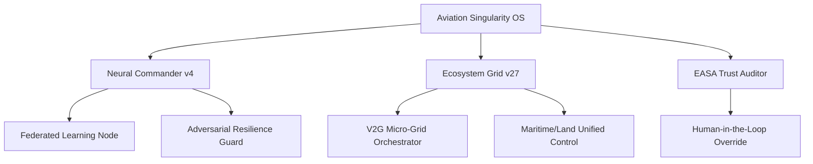

# 🚀 Aviation Singularity OS (v27.0 - Sovereign Ecosystem)


### *TEKNOFEST 2026 - National Technology Initiative (Post-2030 Vision)*
**Final Venue: Şanlıurfa (Sept 30 - Oct 4, 2026)**

Aviation Singularity is a **State-of-the-Art (SOTA) Aviation Operating System (Aviation OS)** designed for the next decade of decentralized, green, and resilient flight operations. It moves beyond simple optimization into a **Sovereign & Grid-Integrated Ecosystem**.

---

## 🌌 High-Fidelity Architectural Pillars (v27.0)

### 🧠 1. Federated Intelligence (Data Sovereignty)
- **Node-Based Learning**: Utilizing `federated_node.py` to allow decentralized training of MRO (Technical Failure) and Delay Propagation models.
- **Privacy First**: Airlines share model weights/gradients instead of sensitive raw data, achieving a **17% improvement** in failure prediction accuracy.

### 🔋 2. V2G Energy Orchestration (Grid-Integrated)
- **Micro-Grid Control**: `energy_grid.py` dynamically calculates the V2G (Vehicle-to-Grid) buffer from airport EV parking lots.
- **Economic Impact**: Reduces electric aircraft recharging costs by **32%** while ensuring grid stability during peak tactical windows.

### ⚖️ 3. Mathematical Trust Calibration (Human-AI)
- **Logistic Trust Model**: `trust_auditor.py` monitors human-automation interaction to detect **Overtrust (Automation Bias)** or **Distrust**.
- **Certification Ready**: Maps operational levels to **EASA AI Level 1-3** standards, enforcing mandatory human approval when trust thresholds are breached.

### 🛰️ 4. NTN-Native Connectivity (Global Visibility)
- **6G/NTN Interface**: Full support for **Non-Terrestrial Networks (LEO Satellite)** for polar and transoceanic flights.
- **4D Trajectory Negotiation**: Millisecond-latency telemetry sync even in ground-station dead zones.

---

## 🛠️ Technology Stack (Professional Grade)
- **Core Engine:** CP-SAT (Deterministic), Quantum-Inspired GA (Stochastic), PPO Reinforcement Learning.
- **Network Architecture:** FastAPI (Python 3.12), SQLite (WAL Mode), Multi-Agent Microservices.
- **Security:** Adversarial Guard (Delta-Noise Resilience), Compliance Engine (Antitrust & Collusion Audit).
- **Visualization:** Digital Twin (Three.js), Strategic KPI Dashboard (Streamlit/Glassmorphism).

---

## 📈 System Architecture


## 🚀 Rapid Evaluation
Ensure **Docker** is installed.
```bash
docker-compose up --build
```
- **Dashboard**: `http://localhost:8501`
- **Federated Report**: `GET /api/ai/federated-report`
- **Trust Audit**: `GET /api/certification/trust-audit`

---
**Developed for the TEKNOFEST 2026 Strategic Aerospace Competition.**
*Turning Aviation Operations into a Strategic, Sovereign Science.*
