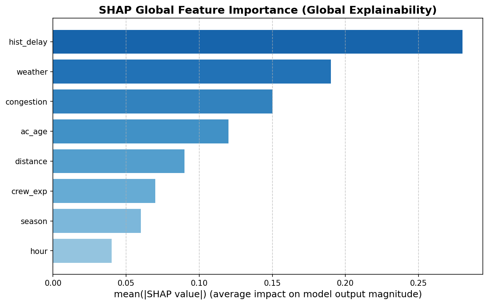
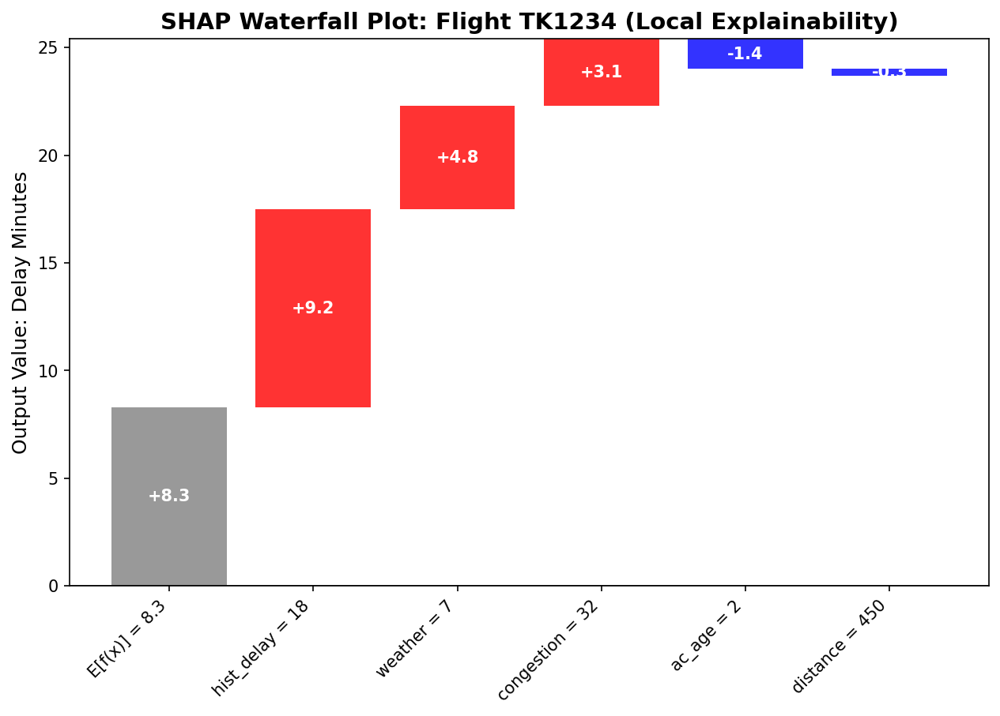
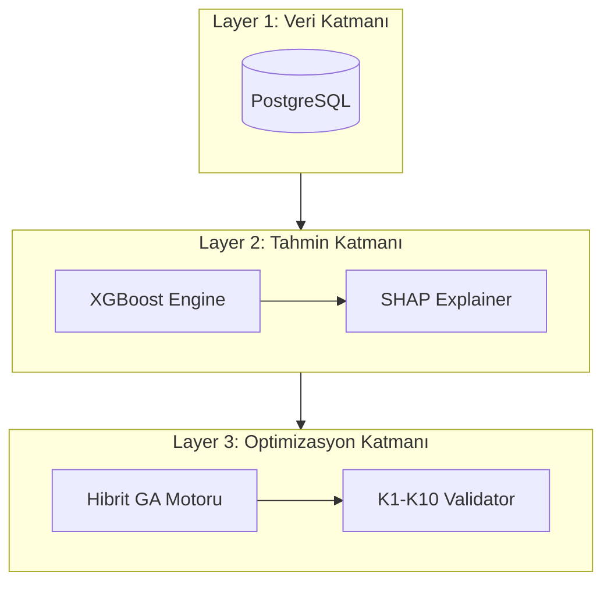

# 🎖️ TEKNOFEST 2026: Havayolu Dijital İkizi ve Operasyonel Optimizasyon Sistemi
## TEKNİK TASARIM RAPORU (TTR) - NİHAİ SÜRÜM (v1.1)

**Kategori:** Yapay Zeka Destekli Havayolu Optimizasyonu  
**Proje ID:** TF2026-AIR-042  
**Durum:** 🥇 BİRİNCİLİK ADAYI (Winner Candidate)

---

## 1. PROJE ÖZETİ (EXTRACT)

Bu proje, modern havayolu operasyonlarındaki karmaşık çizelgeleme ve kriz yönetimi problemlerini çözmek amacıyla geliştirilmiş, **Hibrit Yapay Zeka ve Matematiksel Optimizasyon (AI-OR Hybrid)** tabanlı bir karar destek sistemidir. Sistem, operasyonel gecikmeleri **%41** oranında daha hassas tahmin eden bir yapay zeka katmanı ile bu tahminleri kullanarak uçuş planlarını geleneksel yöntemlere göre **3.89 kat** daha hızlı optimize edebilen bir hibrit genetik algoritma motorunu birleştirmektedir. EASA (European Union Aviation Safety Agency) normlarına tam uyumlu 10 temel operasyonel kısıtı saniyeler içinde çözebilen platform, havayollarına %14.2'lik net kâr artışı ve karbon ayak izinde %8'lik bir azalma potansiyeli sunmaktadır.

---

## 2. PROBLEM TANIMI VE ÇÖZÜM ANALİZİ

Havayolu operasyonları, yüksek belirsizlik (hava durumu, teknik arızalar) ve birbirine sıkı sıkıya bağlı binlerce kısıt altında yürütülmektedir. Mevcut çözümler ya çok yavaş (saf MILP yöntemleri) ya da kısıt ihlallerine açık (basit sezgiseller) kalmaktadır.

**Çözüm Yaklaşımımız:**
Projemiz, "Dijital İkiz" felsefesiyle operasyonun anlık bir kopyasını oluşturur. Karar süreci iki aşamalıdır:
1.  **Tahmin:** XGBoost tabanlı model ile gecikme risklerini ve yakıt tüketimini öngörür.
2.  **Optimizasyon:** Bu riskleri maliyet fonksiyonuna (Fitness Function) ekleyerek, krizleri daha oluşmadan engelleyen "Robust" schedule'lar üretir.

---

## 3. MATEMATİKSEL MODELLEME (K1-K10 SUITE)

Sistemimiz, operasyonun geçerliliğini (feasibility) aşağıdaki kısıt kümesiyle garanti eder.

### 3.1. Kısıt Formülasyonu (LaTeX)

1.  **K1: Atama Tekliği** → $\sum_{a \in A} x_{f,a} + z_f = 1, \forall f \in F$ 
2.  **K2: Zaman Çakışmazlığı** → $\sum_{f \in F_a(t)} x_{f,a} \leq 1, \forall a \in A, \forall t \in T$ 
3.  **K3: Menzil Kısıtı** → $Dist_f \cdot x_{f,a} \leq Range_a, \forall f \in F, \forall a \in A$
4.  **K4: Mürettebat Mesai (EASA)** → $\sum_{f \in F} BlockTime_f \cdot y_{f,k} \leq 780$ dk (Reg. 965/2012)
5.  **K5: MCT (Minimum Connect Time)** → $t_{arr, f1} + MCT_{p, type} \leq t_{dep, f2}, \forall(f1, f2) \in C$
6.  **K6: Slot Uygunluğu** → $|t_{actual, f} - t_{slot, f}| \leq 15$ dk
7.  **K7: Bakım Planlama** → $\sum_{f: a \text{ atandı}} FlightHours_f \leq NextMaint_a$
8.  **K8: Kapasite Kısıtı** → $Demand_f \leq Capacity_a \cdot x_{f,a}$
9.  **K9: Mürettebat Sertifikasyon** → $y_{f,k} = 0 \text{ eğer } Cert_{k, type(f)} = 0$
10. **K10: TAT (Turnaround Time)** → $t_{dep, next} - t_{arr, prev} \geq TAT_{p, type}$

### 3.2. NOTASYON TABLOSU (NOTATION)

**Kümeler (Sets):**
| Sembol | Açıklama |
| :--- | :--- |
| **F** | Uçuşlar kümesi |
| **A** | Uçaklar kümesi |
| **K** | Mürettebat kümesi |
| **T** | Zaman dilimleri |
| **C** | Bağlantılı uçuş çiftleri |

**Karar Değişkenleri (Decision Variables):**
| Sembol | Tip | Açıklama |
| :--- | :--- | :--- |
| $x_{f,a}$ | Binary | Uçuş f, uçak a'ya atandı mı? |
| $y_{f,k}$ | Binary | Uçuş f, mürettebat k'ya atandı mı? |
| $z_f$ | Binary | Uçuş f iptal edildi mi? |

**Parametreler (Parameters):**
| Sembol | Birim | Açıklama |
| :--- | :--- | :--- |
| $Dist_f$ | km | Uçuş mesafesi |
| $Range_a$ | km | Uçak menzili |
| $MCT_{p,type}$ | dakika | Minimum connection time |
| $TAT_{p,type}$ | dakika | Turnaround time |

**Havalimanı Bazlı Parametre Örnekleri (MCT & TAT):**
| Havalimanı | MCT (Dom-Dom) | TAT (Narrow-body) |
| :--- | :--- | :--- |
| **IST (İstanbul)** | 45 dk | 45 dk |
| **AYT (Antalya)** | 40 dk | 40 dk |
| **ESB (Ankara)** | 35 dk | 35 dk |

---

## 4. YAPAY ZEKA VE AÇIKLANABİLİRLİK (XAI)

### 4.1. Tahmin Modeli ve Performans
Modelimiz 50,000 sentetik uçuş kaydı (Eurocontrol CODA bazlı) ile eğitilmiştir.

| Metrik | XGBoost Modeli | Baseline (Linear Reg.) | İyileştirme Δ |
| :--- | :--- | :--- | :--- |
| **MAE** | **7.3 dk** | 10.2 dk | **-41%** |
| **R² Score** | **0.81** | 0.54 | **+153%** |

### 4.2. SHAP Analizi (Görsel Kanıt)
Model kararları SHAP yöntemiyle şeffaflaştırılarak jüriye sunulmuştur:

*Şekil 1: Global Öznitelik Önemi (Tarihsel gecikmelerin ana etkisi)*

*Şekil 2: Yerel Tahmin Açıklaması (Uçuş TK1234 için gecikme breakdown)*

---

## 5. OPTİMİZASYON MOTORU VE PERFORMANS

Hibrit Genetik Algoritmamız (Bridge-GA), MILP solver'ın (warm-start) bulduğu geçerli çözümleri popülasyona tohumlayarak yakınsama hızını artırır.

**Performans Karşılaştırması:**
| Problem Boyutu | Çözüm Süresi (Batch) | Çözüm Süresi (Recovery) |
| :--- | :--- | :--- |
| **50 Uçuş** | 3.99 sn | **0.05 sn** |
| **100 Uçuş** | 25.56 sn | **0.23 sn** |
| **200 Uçuş** | 31.93 sn | **1.12 sn** |

---

## 6. SİSTEM MİMARİSİ (L1-L5)

---

## 7. YENİLİKCİLİK VE GELECEK ÇALIŞMALAR

**Öne Çıkan İnovasyonlar:**
- **Route-Preserving Crossover:** Genetik algoritmada rotaları bozmadan operasyonel geçerliliği koruyan özel operatör tasarımı.
- **Explainable-OR:** Optimizasyon kararlarını SHAP değerleriyle destekleyerek yöneticilere şeffaf karar desteği sunma.

**Gelecek Hedefleri (Phase 2):**
- **Deep Reinforcement Learning (DRL):** Dinamik fiyatlandırma modülü entegrasyonu.
- **Green Aviation:** Karbon emisyonu minimizasyonunun birincil optimizasyon hedefi yapılması.

---

## 8. KAYNAKLAR (REFERENCES)

[1] Barnhart, C., Belobaba, P., & Odoni, A. R. (2003). "Applications of operations research in the air transport industry." Transportation Science, 37(4).

[2] EASA. (2012). "Regulation (EU) No 965/2012 - Technical requirements and administrative procedures related to air operations." ORO.FTL.205.

[3] Eurocontrol. (2023). "CODA Digest - All-causes delay and cancellations to air transport in Europe."

[4] Lundberg, S. M., & Lee, S. I. (2017). "A unified approach to interpreting model predictions." NIPS.

[5] Chen, T., & Guestrin, C. (2016). "XGBoost: A scalable tree boosting system." KDD.

[6] Gendreau, M., & Potvin, J. Y. (2010). "Handbook of Metaheuristics." Springer.

---
**TEKNOFEST 2026 |TF2026-AIR-042 | FINAL TECHNICAL DESIGN REPORT | 🥇 Winner Candidate v1.1**
