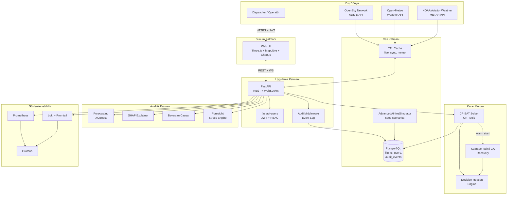
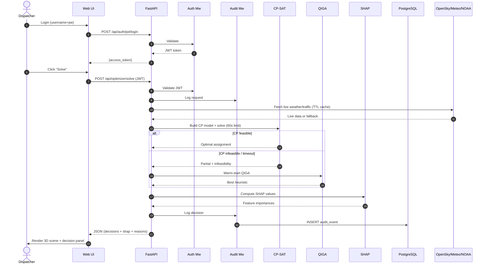
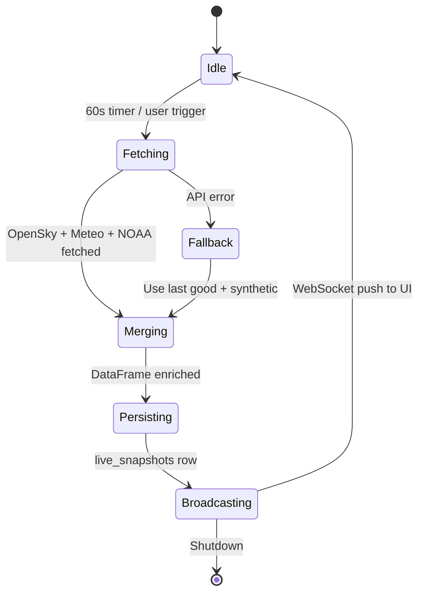

# Bölüm 4 — Sistem Mimarisi

## 4.1 Yüksek Seviyeli Bakış

Sistem; **sunum (Web UI)**, **uygulama (FastAPI)**, **karar motoru (CP-SAT + QIGA)**, **analitik (XAI + forecasting)**, **veri (PostgreSQL + TTL cache)** ve **dış entegrasyon (OpenSky, Open-Meteo, NOAA)** olmak üzere altı mantıksal katmandan oluşur. Bu bölüm, her katmanı ve aralarındaki etkileşimi detaylandırır.

## 4.2 Şekil 4.1 — Katmanlı Sistem Mimarisi



## 4.3 Şekil 4.2 — Veri Akış Diyagramı (Uçuş Optimizasyon Çağrısı)

Kullanıcının `/api/optimizer/solve` endpoint'ini çağırmasıyla başlayan uçtan uca akış:



## 4.4 Şekil 4.3 — Dijital İkiz Güncelleme Döngüsü

Dijital ikiz, fiziksel uçuş operasyonunun bilgi-uzayındaki yansımasıdır. Güncelleme her 60 saniyede bir veya kullanıcı tetiklemesiyle gerçekleşir:



**Merging stratejisi**: Canlı feed'teki pozisyonlar (`lat, lon, velocity, track`) sentetik senaryo DataFrame'indeki uçuşlarla **(origin, destination, departure_hour)** anahtarında **left join** ile birleştirilir. Eksik alanlar (SAF kullanımı, yolcu bağlantıları) sentetik değerlerini korur.

## 4.5 Katman Bazlı Detaylar

### 4.5.1 Sunum Katmanı

Web arayüzü üç ana görünüm sunar:

| Görünüm | Teknoloji | Amaç |
|---|---|---|
| **3D Scene** | Three.js | Uçakların anlık konumu, meydan kuleleri, irtifa profili |
| **2D Map** | MapLibre GL + Maptiler | Dünya haritası, rotalar, gerçek zamanlı izleme |
| **Decision Panel** | HTML + Chart.js | KPI'lar, iptal listesi, SHAP bar chart, `decision_reason` filtreleme |

Frontend **SPA** (Single Page App) olarak tasarlanmıştır; sadece FastAPI'nin `/api/*` endpoint'lerini tüketir. Statik dosyalar FastAPI'nin `StaticFiles` mount'u ile servis edilir.

### 4.5.2 Uygulama Katmanı

FastAPI, async-native bir ASGI çerçevesidir. Middleware yığını:

```python
app.add_middleware(CORSMiddleware, allow_origins=_ALLOWED_ORIGINS, ...)
app.add_middleware(AuditMiddleware)
app.add_middleware(RequestIDMiddleware)  # correlation_id enjekte eder
```

**Router taksonomisi**:

| Prefix | Roller | İçerik |
|---|---|---|
| `/api/auth/*` | public + authd | Login, register, refresh |
| `/api/scenario` | viewer+ | Mevcut senaryo verisini getir |
| `/api/optimizer/*` | operator+ | Solve, recover |
| `/api/forecast/*` | viewer+ | 7 günlük tahmin |
| `/api/foresight/*` | operator+ | Stress senaryoları |
| `/api/xai/*` | viewer+ | SHAP + counterfactual |
| `/api/export/*` | viewer+ | PDF, XLSX, CSV raporlar |
| `/metrics` | scrape | Prometheus |
| `/healthz`, `/readyz` | public | K8s probe |

### 4.5.3 Karar Motoru

CP-SAT ve QIGA modülleri `src/optimizer/dt_solver.py` ve `src/optimizer/hybrid_ga.py` dosyalarında bulunur. Aralarındaki arayüz şudur:

```python
class SolverResult:
    assignments: dict[str, str]       # flight_id -> aircraft_id
    crew_assignments: dict[str, str]  # flight_id -> crew_id
    delays: dict[str, int]            # flight_id -> minutes
    cancellations: set[str]           # flight_id set
    objective: float                  # total profit (TL)
    status: Literal["OPTIMAL", "FEASIBLE", "INFEASIBLE", "TIMEOUT"]
    decision_reasons: dict[str, str]  # flight_id -> reason code
```

CP-SAT TIMEOUT veya INFEASIBLE döndüğünde, mevcut en iyi partial atama QIGA'ya **warm-start seed** olarak verilir.

### 4.5.4 Analitik Katman

Her analitik alt modül bağımsız Python sınıfıdır ve `state.df` üzerinde çalışır:

- **ForecastEngine** → 7 günlük günlük-bazlı PLF (Passenger Load Factor) ve disruption risk tahmini (XGBoost)
- **ForesightEngine** → What-if stress senaryoları (örn. "IST meydanı 3 saat kapalı")
- **SHAP Explainer** → XGBoost model çıktılarını feature-level açıklama
- **Bayesian Causal Attribution** → Gecikmenin kaynağını (weather vs tech vs crew) olasılıksal atama

### 4.5.5 Veri Katmanı

**Kalıcılık**: PostgreSQL (prod) / SQLite+aiosqlite (dev).
**Ana tablolar** (detay Ek A):
- `user` (fastapi-users)
- `audit_events`
- `flights` (v28 ile eklendi; sentetik seed + canlı merge)
- `live_snapshots` (her dijital ikiz turunun metadata'sı)

**Cache**: `src/data_connectors/live_sync.py` içindeki `_TTLCache` sınıfı; trafik için 60s TTL, hava için 600s TTL, NOAA METAR için 900s TTL.

### 4.5.6 Gözlemlenebilirlik

Prometheus client ile sunulan metrikler:

| Metrik | Tür | Etiketler |
|---|---|---|
| `solver_requests_total` | Counter | strategy |
| `solver_duration_seconds` | Histogram | status |
| `api_request_duration_seconds` | Histogram | method, path, status |
| `live_sync_fallback_total` | Counter | source |
| `ftl_breach_total` | Counter | reason |

Grafana dashboard: `deploy/monitoring/grafana-datasources.yml` ile sağlanır.

## 4.6 Docker Compose Topolojisi

`docker-compose.yml` aşağıdaki servisleri tanımlar:

```yaml
services:
  api:          # FastAPI + Uvicorn
  postgres:     # 15-alpine
  prometheus:   # scrape api:/metrics
  loki:         # structured log aggregation
  promtail:     # ship container logs to loki
  grafana:      # dashboards
  caddy:        # TLS reverse proxy (prod)
```

Network: tek bir `avlabs` bridge network'ü; servisler isim bazında resolve edilir.

## 4.7 Güvenlik Sınırları

| Sınır | Koruma |
|---|---|
| **Kimlik** | JWT + bcrypt hashed password |
| **Yetki** | RBAC: `viewer`, `operator`, `admin` |
| **CORS** | `ALLOWED_ORIGINS` env |
| **Rate Limit** | slowapi: `30/minute` default |
| **TLS** | Caddy + Let's Encrypt |
| **Secrets** | `.env` — gitignore'da |
| **DB Injection** | SQLAlchemy ORM (parametric bind) |
| **XSS** | Frontend: `textContent` preferred over `innerHTML`; CSP header |
| **CSRF** | Pure JWT Bearer; cookie kullanılmaz |

## 4.8 Ölçeklenebilirlik Senaryoları

Mevcut mimari **150–500 uçuş/pod** kapsamındadır. Endüstri ölçeği (3000+ uçuş/gün) için:

- **Yatay ölçeklendirme**: API pod'ları stateless; oturum state Redis'te.
- **Rolling horizon**: 15 dakikada bir 4 saatlik pencereyi yeniden çöz.
- **Multi-fleet**: Narrow/Wide/Regional ayrı solver instance'ları, final birleştirme.

Detaylar `INDUSTRY_ROADMAP.md` Faz F'de belgelenmiştir.

Bölüm 5, karar motorunun **matematiksel formülasyonunu** sunar.
