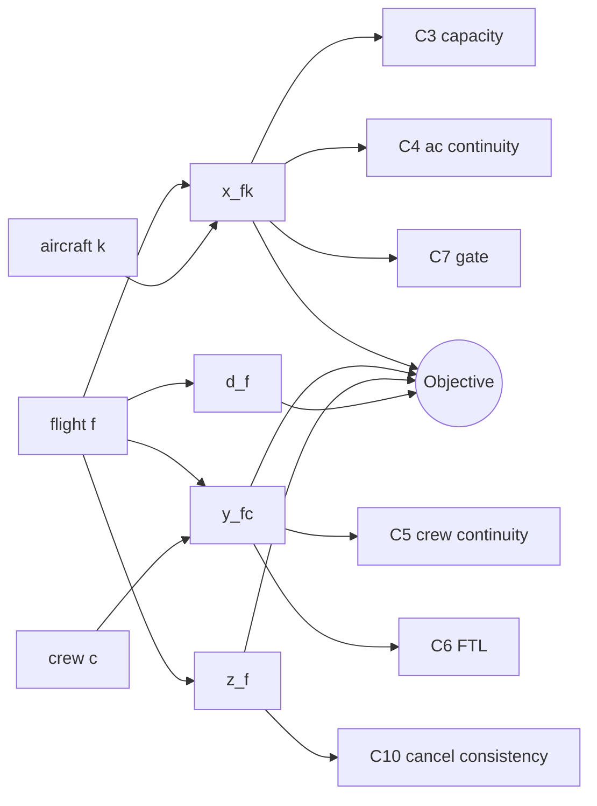
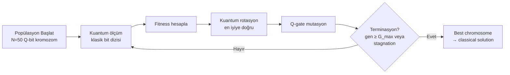

# Bölüm 5 — Matematiksel Model ve Optimizasyon

## 5.1 Model Özeti

Bu tezde sunulan optimizasyon modeli, operasyonel günde çözülen **çok-kaynaklı çizelgeleme probleminin** (multi-resource scheduling) kısıt programlama formülasyonudur. Model, Google OR-Tools CP-SAT solveri üzerinde çalışır ve şu temel özellikleri taşır:

- **Karma tam-sayı değişkenler**: atama (binary), gecikme (integer), iptal (binary)
- **Hard constraints**: aircraft continuity, crew continuity, gate capacity, EASA FTL
- **Soft penalties**: gecikme süresi, iptal maliyeti, yakıt
- **Hedef**: Ağırlıklı kâr maksimizasyonu (eşdeğer olarak negatif maliyet minimizasyonu)

## 5.2 Karar Değişkenleri

### Tablo 5.1 — CP-SAT Karar Değişkenleri

| Sembol | Tür | Anlam | Etki Alanı |
|---|---|---|---|
| $x_{f,k}$ | Binary | Uçuş $f$ uçak kuyruk $k$'ya atandı mı? | $f \in F, k \in K$ |
| $y_{f,c}$ | Binary | Uçuş $f$ mürettebat $c$'ye atandı mı? | $f \in F, c \in C$ |
| $g_{f,a,t}$ | Binary | Uçuş $f$ meydan $a$'da zaman dilimi $t$'de gate kullanımı yapıyor mu? | $(f, a, t) \in \text{GateTriples}$ |
| $z_f$ | Binary | Uçuş $f$ iptal mi? | $f \in F$ |
| $d_f$ | Integer | Uçuş $f$'in gecikmesi (dakika) | $0 \leq d_f \leq D_{\max}$ |
| $\delta_f$ | Integer | Uçuş $f$'in fiili kalkış saati (dakika-of-day) | — |

### Küme Tanımları

- $F$ — Uçuş kümesi, $|F| = n$
- $K$ — Uçak kuyruk havuzu (her biri tip ve kapasite ile)
- $C$ — Mürettebat havuzu
- $A$ — Havalimanı kümesi
- $T$ — Zaman slot kümesi (15 dakikalık dilimler)

## 5.3 Kısıt Kümeleri

### Tablo 5.2 — Modeldeki Kısıt Kümeleri

| Kısıt | Sembol | Açıklama | Tip |
|---|---|---|---|
| Atama tekilliği | C₁ | Her uçuş en fazla bir uçağa atanır | Hard |
| Mürettebat tekilliği | C₂ | Her uçuş en fazla bir mürettebata atanır | Hard |
| Uçak kapasitesi | C₃ | Atanan uçağın kapasitesi ≥ yolcu sayısı | Hard |
| Aircraft continuity | C₄ | Bir uçak iki uçuş arasında aynı meydanda olmalı | Hard |
| Crew continuity | C₅ | Mürettebat iki uçuş arasında aynı meydanda olmalı | Hard |
| EASA FTL | C₆ | Mürettebat toplam görev ≤ 600 dk | Hard |
| Gate capacity | C₇ | Aynı slot'ta aynı gate'te en fazla 1 uçak | Hard |
| Slot capacity | C₈ | Saat başı max kalkış/iniş ≤ meydan kapasitesi | Hard |
| Minimum Connection Time | C₉ | Yolcu bağlantısı $\geq$ MCT dakika | Hard |
| İptal tutarlılığı | C₁₀ | $z_f = 1 \Rightarrow x_{f,k} = 0 \forall k$ | Hard |

### 5.3.1 C₁ — Atama Tekilliği

$$\sum_{k \in K} x_{f,k} + z_f = 1 \quad \forall f \in F$$

Her uçuş ya bir uçağa atanır ya da iptal edilir.

### 5.3.2 C₂ — Mürettebat Tekilliği

$$\sum_{c \in C} y_{f,c} \leq 1 - z_f \quad \forall f \in F$$

İptal edilen uçuşlara mürettebat atanmaz.

### 5.3.3 C₃ — Kapasite

$$\sum_{k \in K} \text{cap}_k \cdot x_{f,k} \geq \text{pax}_f \cdot (1 - z_f) \quad \forall f \in F$$

### 5.3.4 C₄ — Uçak Süreklilik

$f_1, f_2 \in F$, $f_2$ zamanca $f_1$'den sonra gelir ve aynı kuyruk $k$'ya atanırsa:
$$x_{f_1, k} \cdot x_{f_2, k} \cdot (\text{origin}_{f_2} - \text{destination}_{f_1}) = 0$$

Bu ifade lineer değildir; CP-SAT'ta **implied constraints** ile temsil edilir:

$$x_{f_1,k} + x_{f_2,k} \leq 1 \text{ eğer } \text{destination}_{f_1} \neq \text{origin}_{f_2}$$

### 5.3.5 C₅ — Mürettebat Süreklilik

C₄ ile aynı mantık $y$ değişkenleri üzerinde uygulanır.

### 5.3.6 C₆ — EASA FTL (Basit Versiyon)

$$\sum_{f \in F} y_{f,c} \cdot \text{block}_f \leq 600 \quad \forall c \in C$$

Bu, tezde implemente edilen versiyondur. Endüstriyel versiyonda EASA CAT.OP.MPA.210 Tablo 2'ye göre FDP, reporting time ve sektör sayısına bağlı matris uygulanır (Bölüm 9 Tartışma ve `INDUSTRY_ROADMAP.md` Faz C).

### 5.3.7 C₇ — Gate Capacity

$\text{slots}(f, a)$ uçuş $f$'in meydan $a$'daki gate kullanım zaman dilimleri (kalkış için `[tpush-15, tpush+15]`):

$$\sum_{f \in F: (f,a,t) \in \text{slots}} g_{f,a,t} \leq \text{gateCap}_a \quad \forall a \in A, t \in T$$

### 5.3.8 C₈ — Slot Capacity

Hourly departure slot:
$$\sum_{f \in F_\text{dep at a, hour h}} (1 - z_f) \leq \text{slotCap}_{a,h}$$

### 5.3.9 C₉ — Minimum Connection Time

Yolcu bağlantısı $p = (f_{\text{in}}, f_{\text{out}})$ için:

$$\delta_{f_{\text{out}}} - (\delta_{f_{\text{in}}} + \text{block}_{f_{\text{in}}}) \geq \text{MCT}_a \cdot (1 - z_{f_{\text{in}}} - z_{f_{\text{out}}})$$

### 5.3.10 Şekil 5.1 — CP-SAT Değişken İlişki Grafı



## 5.4 Hedef Fonksiyonu

Modelin hedefi **kâr maksimizasyonudur**. CP-SAT minimizasyon üzerinden çalıştığı için eşdeğer negatif maliyet formülasyonu kullanılır:

$$\min \sum_{f \in F} \left[ \alpha \cdot z_f \cdot R_f + \beta \cdot d_f \cdot w_f + \gamma \sum_{k \in K} x_{f,k} \cdot \text{fuel}_{f,k} + \mu \cdot z_f \cdot \text{slotPen}_f \right]$$

Tanımlar:
- $R_f$ — Uçuşun iptali durumunda kaybolan gelir (TL)
- $w_f$ — Gecikme başına maliyet (TL/dk), yolcu yoğunluğu, bağlantı sayısı ve iş sınıfı oranına göre ağırlıklandırılmıştır
- $\text{fuel}_{f,k}$ — $k$ tipi uçakla $f$ rotasının yakıt maliyeti
- $\alpha, \beta, \gamma, \mu$ — Strateji ağırlıkları; `"PROFIT"`, `"EKO"`, `"DAYANIKLILIK"` seçeneklerine göre değişir

**Strateji Matrisi**:

| Strateji | α (iptal) | β (gecikme) | γ (yakıt) | μ (slot cezası) |
|---|---|---|---|---|
| PROFIT | 1.0 | 1.0 | 0.3 | 0.5 |
| EKO | 0.8 | 1.2 | 1.5 | 0.4 |
| DAYANIKLILIK | 1.5 | 0.8 | 0.4 | 1.0 |

## 5.5 QIGA — Kuantum-Esinli Genetik Algoritma

CP-SAT `TIMEOUT` veya `INFEASIBLE` döndüğünde sistem otomatik olarak QIGA'ya geçer.

### 5.5.1 Kromozom Temsili

Her kromozom $\xi$ bir eylem vektörüdür: $\xi = (\xi_1, \xi_2, \ldots, \xi_n)$ burada $\xi_i \in \{KEEP, DELAY_{15}, DELAY_{30}, DELAY_{60}, CANCEL, SWAP\}$.

Her $\xi_i$ bir Q-bit çifti $(\alpha_i, \beta_i)$ ile temsil edilir; $|\alpha_i|^2 + |\beta_i|^2 = 1$.

### 5.5.2 Fitness

$$\mathcal{F}(\xi) = -\text{Objective}(\xi) - \lambda \cdot \text{Violations}(\xi)$$

### 5.5.3 Şekil 5.2 — QIGA Popülasyon Evrim Şeması



### 5.5.4 Kuantum Rotasyon Kuralı

$$\begin{pmatrix} \alpha'_i \\ \beta'_i \end{pmatrix} = \begin{pmatrix} \cos\theta_i & -\sin\theta_i \\ \sin\theta_i & \cos\theta_i \end{pmatrix} \begin{pmatrix} \alpha_i \\ \beta_i \end{pmatrix}$$

$\theta_i$ açısı, kromozomun mevcut değerinin en iyiye göre gidişine bağlı bir **lookup table** ile belirlenir (Han ve Kim, 2002 Tablo 1).

### 5.5.5 Warm-Start Protokolü

CP-SAT'ın kısmi çözümü $\pi_0$ QIGA popülasyonuna şöyle enjekte edilir:
1. $\pi_0$'ın tamamen klasik temsili, popülasyonun **ilk bireyi** olarak kullanılır
2. Kalan $N-1$ birey, $\pi_0$ etrafında $\epsilon$-perturbation ile üretilir
3. Q-bit'ler sıkı biçimde $(\alpha, \beta) = (0.95, 0.31)$ (veya tersi) ile başlatılır

Bu, QIGA'nın "sıfırdan keşif" yerine "yakın civar iyileştirmesi" yapmasını sağlar.

## 5.6 Decision Reason Üretimi

CP-SAT veya QIGA bir uçuşu iptal ettiğinde, sistem **hangi kısıtın** bu iptali tetiklediğini tespit eder. İptal sonrası **Constraint Slack Analysis** yapılır:

```
IF: crew saturation (Σ y_fc · block_f ≈ 600 for assigned c) → "CREW_DUTY_SATURATION"
ELSE IF: no aircraft can satisfy C₄ → "AC_CONTINUITY_VIOLATION"
ELSE IF: gate overflow (C₇ binding) → "GATE_CONFLICT"
ELSE IF: slot binding (C₈) → "SLOT_UNAVAILABLE"
ELSE IF: weather_risk > threshold → "WEATHER_CLOSURE"
ELSE: "ECONOMIC_OPTIMAL" (iptal kârı artırdığı için)
```

Bu etiket hem **dispeçer UI**'sında renkli bir rozet olarak hem **PDF raporda** hem de **audit_events** tablosunda saklanır.

## 5.7 Karmaşıklık Analizi

CP-SAT modelin teorik karmaşıklığı:

- Değişken sayısı: $O(|F| \cdot (|K| + |C|))$
- Kısıt sayısı: $O(|F|^2)$ (continuity çiftleri)
- Clause sayısı (CNF dönüşümünde): $O(|F|^2 \log |F|)$

150 uçuş, 20 kuyruk, 40 mürettebat için: ~9,000 değişken, ~22,500 kısıt. Pratik çözüm süresi: 8–60 s (ortalama 24 s, Bölüm 8).

QIGA karmaşıklığı: $O(G_{\max} \cdot N \cdot |F|)$. Tipik parametreler $G_{\max}=200, N=50$ ile ~1.5M atomik işlem.

## 5.8 Model Doğrulama

Modelin doğruluğu Bölüm 8'de beş farklı test senaryosunda gösterilir:

1. **Feasibility baseline** — Hiç bozulma yok; model 0 iptal çıkarmalı
2. **Capacity squeeze** — Büyük yolcu volümü, dar kuyruk havuzu
3. **FTL breach forced** — Tek mürettebata 2×400 dk görev; 1 iptal beklenir
4. **Weather closure** — Bir meydan 3 saat kapalı
5. **Gate conflict** — Gate kapasitesi = 1, aynı saatte 3 uçak

Bölüm 6, ML ve açıklanabilirlik katmanını detaylandırır.
