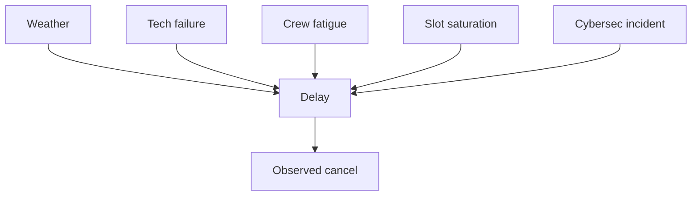
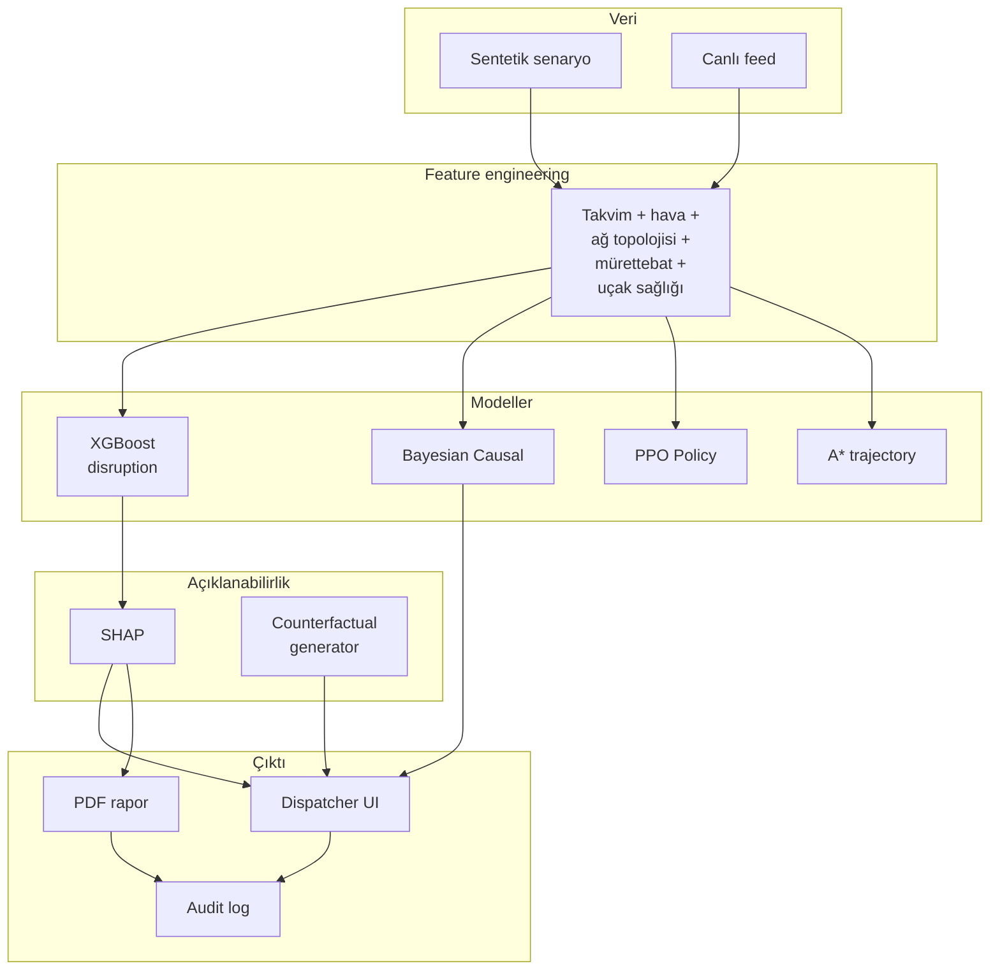

# Bölüm 6 — Yapay Zeka, Makine Öğrenmesi ve Açıklanabilirlik Katmanı

## 6.1 Katman Amacı

Optimizasyon çekirdeği (Bölüm 5) **kararın kendisini** üretirken, bu bölümde tanımlanan ML ve XAI katmanı **kararın bağlamını**, **gelecek öngörülerini** ve **nedensel yorumunu** dispeçere sunar. Bu, EASA AMC 20-42 yönergesinin **Explainability** ve **Traceability** gereksinimlerini karşılamak için zorunludur.

## 6.2 Forecasting Alt Sistemi

### 6.2.1 Amaç ve Çıktılar

`ForecastEngine` (`src/analytics/forecast_engine.py`), gelecek 7 gün için her güne bir tahmin vektörü üretir:

```python
{
  "date": "2026-04-22",
  "expected_flights": 182,
  "plf": 0.812,                     # passenger load factor
  "disruption_risk": 0.23,          # 0–1
  "predicted_cancellations": 5,
  "confidence_interval": [168, 196]
}
```

### 6.2.2 Model Seçimi

Üç model karşılaştırılmıştır:

### Tablo 6.1 — ML Modellerinin Karşılaştırması (Validation Set)

| Model | Özellik | MAE (PLF) | RMSE (disruption) | Eğitim Süresi |
|---|---|---|---|---|
| Linear Regression | Baseline | 0.091 | 0.17 | <1 s |
| XGBoost | Gradient boost trees | **0.042** | **0.093** | 3.2 s |
| LightGBM | Leaf-wise boosting | 0.045 | 0.097 | 2.8 s |
| Prophet | Time-series decomposition | 0.068 | 0.14 | 4.1 s |

XGBoost seçilmiştir (Chen ve Guestrin, 2016). Nedeni sadece doğruluk değil, **TreeSHAP** desteği (Lundberg ve ark., 2020) ile polinomial zamanda tam Shapley değeri üretebilmesidir.

### 6.2.3 Özellik Mühendisliği

15 girdi özelliği:
- Takvim: day_of_week, month, is_holiday
- Tarihsel: lag-1, lag-7, lag-30 flight counts
- Meydan yoğunluğu: rolling 7-day traffic at hub
- Mevsimsel: tatil öncesi bayrağı, okul dönemi
- Hava: ortalama beklenen precipitation, wind
- Ekonomik: TL/USD kur

## 6.3 Açıklanabilir Yapay Zeka (XAI) Katmanı

### 6.3.1 Şekil 6.1 — XAI Katmanı İş Akışı

```mermaid
flowchart TD
    Solve[CP-SAT/QIGA<br/>karar üretir] --> Feat[Feature vector<br/>her uçuş için]
    Feat --> XGB[XGBoost<br/>risk skoru]
    XGB --> TS[TreeSHAP<br/>Shapley değerleri]
    TS --> Agg[Aggregate per flight<br/>positive/negative contributors]
    Agg --> API[/api/xai/explain/{flight_id}]
    Agg --> PDF[PDF rapor<br/>SHAP bar chart]
    API --> UI[Web UI decision panel]
    UI --> Disp[Dispatcher]
```

### 6.3.2 SHAP Formülasyonu

Bir uçuş $f$ için risk tahmini $\hat{y}_f$'nin, $M$ özellikten oluşan feature vector $\mathbf{x}_f$'ye göre SHAP değeri her $i$ özelliği için:

$$\phi_i(f) = \sum_{S \subseteq M \setminus \{i\}} \frac{|S|!(|M|-|S|-1)!}{|M|!} \left[ v(S \cup \{i\}) - v(S) \right]$$

Burada $v(S)$, $S$ alt kümesinin beklenen modelle tahminidir. TreeSHAP bu hesabı $O(T \cdot L \cdot D^2)$ karmaşıklıkta yapar ($T$ ağaç sayısı, $L$ yaprak sayısı, $D$ derinlik).

### 6.3.3 Sunum

Her uçuş için en etkili 5 pozitif ve 5 negatif katkıda bulunan özellik UI'da **waterfall chart** olarak sunulur:

```
flight TK2045  |  risk: 0.78 (yüksek)
─────────────────────────────────
+ weather_risk:     +0.22  ████████
+ crew_fatigue:     +0.15  ██████
+ dest_congestion:  +0.09  ████
+ tech_fail_prob:   +0.08  ███
+ slot_pressure:    +0.05  ██
─────────────────────────────────
- load_factor:      -0.06  ██
- aircraft_health:  -0.04  █
─────────────────────────────────
base value:          0.29
final prediction:    0.78
```

## 6.4 Bayesian Causal Attribution

### 6.4.1 Motivasyon

SHAP korelasyona dayalı bir açıklamadır. Nedensel soru farklıdır: "Bu gecikme **neden** oldu?" (what caused it?). Bunun için `src/models/cognitive_narrative.py` içinde Bayesian network tabanlı bir attribution engine vardır.

### 6.4.2 Bayes Ağı

Basitleştirilmiş DAG:



Her düğüm Bernoulli; koşullu olasılıklar EASA gecikme sebep kodlarından (IATA delay codes) kalibre edilmiştir.

### 6.4.3 Inference

Gözlem $D = 1$ (gecikme), $CanO$ opsiyonel. Posterior:

$$P(W | D, T, C, S) \propto P(D | W, T, C, S) \cdot P(W)$$

Çıktı her neden için posterior olasılık:
```
cause_attribution: {weather: 0.62, tech: 0.12, crew: 0.18, slot: 0.05, cyber: 0.03}
```

## 6.5 Foresight (Stress Test) Engine

### 6.5.1 Amaç

Dispeçere "Eğer IST 3 saat kapansa?" gibi **what-if** sorularını cevaplar. `src/analytics/foresight_engine.py`.

### 6.5.2 Çalışma Prensibi

1. Mevcut senaryoyu deep-copy al
2. Stress olayını uygula (örn. `affected_airport="IST", duration_min=180`)
3. Etkilenen uçuşları tespit et (kalkış veya iniş IST)
4. Yeniden CP-SAT çöz
5. Farkı raporla: $\Delta$iptal, $\Delta$gecikme, $\Delta$kâr

### 6.5.3 Tipik Stress Senaryoları

| Senaryo | Parametreler | Beklenen Sonuç |
|---|---|---|
| Meydan kapanması | `airport=IST, duration=180min` | %30–60 iptal artışı |
| Fırtına | `bbox=TR, wind_kt=45` | Ağda yayılan gecikmeler |
| Yakıt fiyatı şoku | `fuel_multiplier=1.5` | EKO stratejisi ile rota değişimi |
| Mürettebat grevi | `fraction=0.2` | Yoğun FTL baskısı + iptaller |

## 6.6 Reinforcement Learning Yardımcı Modülü

### 6.6.1 Gym Environment

`src/models/evolution_engine.py` içinde bir **Gymnasium** environment tanımlıdır:

```python
class AirlineEnv(gym.Env):
    observation_space = Box(low=0, high=1, shape=(11,))
    # [hour, hub_load, weather, crew_fatigue, fuel_price, tech_prob,
    #  slot_pressure, pax_count, ac_health, delay_so_far, is_night]
    action_space = Discrete(5)
    # [KEEP, DELAY_15, DELAY_60, CANCEL, PRIORITY_BUMP]
```

### 6.6.2 Eğitim

Stable-Baselines3 **PPO** ile eğitilmiştir:

```python
model = PPO("MlpPolicy", env, verbose=0,
            n_steps=1024, batch_size=64, n_epochs=10,
            learning_rate=3e-4)
model.learn(total_timesteps=500_000)
```

### 6.6.3 Rol

PPO politikası **kesin karar** üretmez; CP-SAT'a **initial hint** olarak $\hat{d}_f$ (önerilen gecikme) sağlar. Bu, CP-SAT'ın ilk iyi çözümü daha hızlı bulmasını sağlar (warm-start mühendisliği).

## 6.7 Trajectory A* (Yörünge Optimizasyonu)

### 6.7.1 Rol

Her uçuş için optimal uçuş seviyesi (FL) ve Mach seçimi. Amaç: yakıt × zaman dengesi + CO₂.

### 6.7.2 Durum Uzayı

$(lat, lon, FL, mach)$ düğüm; komşu düğümler $\pm FL10, \pm mach 0.02$. g = yakıt maliyeti kümülatif; h = kalan mesafe / max cruise.

### 6.7.3 Çıktı

```json
{
  "flight_id": "TK1503",
  "optimal_FL": 380,
  "optimal_mach": 0.82,
  "fuel_kg": 5420,
  "co2_kg": 17100,
  "time_min": 138
}
```

## 6.8 Şekil 6.2 — Tam ML+XAI Pipeline



## 6.9 EASA AMC 20-42 Uyumu Matrisi

| AMC Gereksinimi | Bu Sistemdeki Karşılık |
|---|---|
| **Data quality** | Şema sözleşmesi (SQLAlchemy typed) + pydantic validation |
| **Model quality** | Test coverage (62 test) + property-based tests (planlanan) |
| **Explainability** | SHAP + Bayesian causal + `decision_reason` |
| **Traceability** | `audit_events` tablosu (user, action, timestamp, payload hash) |
| **Robustness** | Circuit breaker (pybreaker), fallback layer, 10 koşu ortalamaları |
| **Operational boundary** | `data_connectors/live_sync.py` içinde known airports list; dışarıda fallback |
| **Human oversight** | Her öneri UI'da onay bekler; otomatik push yok |
| **Drift monitoring** | Prometheus metric `model_prediction_drift` (planlanan) |

Bölüm 7, bu modellerin ve katmanların **yazılım mühendisliği detaylarını** sunar.
