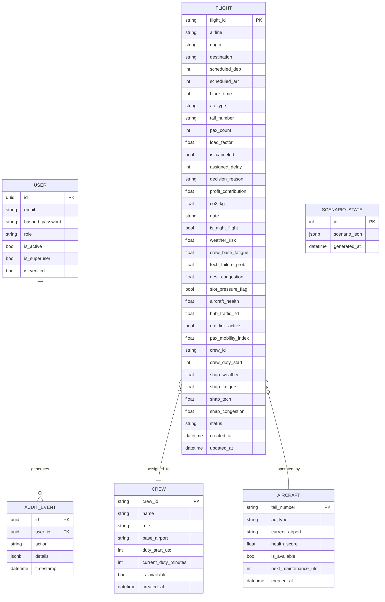

# Ek A — Veritabanı Şeması

Bu ek, sistemin üretim veritabanı şemasını (PostgreSQL 15) belgeler. Tüm tablolar Alembic migration
`836c756c6b73_complete_unified_production_schema.py` ile oluşturulur.

---

## A.1 Entity–Relationship Diyagramı



---

## A.2 Tablo Detayları

### A.2.1 `user`

fastapi-users tarafından yönetilen kimlik doğrulama tablosu.

| Sütun | Tip | Kısıt | Açıklama |
|---|---|---|---|
| `id` | UUID | PK, NOT NULL | UUID v4 birincil anahtar |
| `email` | VARCHAR(320) | UNIQUE, NOT NULL | Kullanıcı e-posta adresi |
| `hashed_password` | TEXT | NOT NULL | bcrypt (cost=12) özeti |
| `role` | VARCHAR(20) | NOT NULL, DEFAULT 'viewer' | `viewer` / `operator` / `admin` |
| `is_active` | BOOLEAN | NOT NULL, DEFAULT TRUE | Hesap aktiflik durumu |
| `is_superuser` | BOOLEAN | NOT NULL, DEFAULT FALSE | Süper kullanıcı bayrağı |
| `is_verified` | BOOLEAN | NOT NULL, DEFAULT FALSE | E-posta doğrulama durumu |

**İndeksler**: `ix_user_email` (UNIQUE)

---

### A.2.2 `flight`

Sistemin ana varlık tablosu. Senaryo üretiminden karar çıktısına kadar tüm uçuş verisi burada tutulur.

| Sütun | Tip | Kısıt | Açıklama |
|---|---|---|---|
| `flight_id` | VARCHAR(20) | PK | `TK1001` formatı |
| `airline` | VARCHAR(10) | NOT NULL | IATA operatör kodu |
| `origin` | CHAR(3) | NOT NULL | IATA kalkış kodu |
| `destination` | CHAR(3) | NOT NULL | IATA varış kodu |
| `scheduled_dep` | BIGINT | NOT NULL | Planlı kalkış (Unix saniye) |
| `scheduled_arr` | BIGINT | NOT NULL | Planlı varış (Unix saniye) |
| `block_time` | INTEGER | NOT NULL | Toplam blok süresi (dakika) |
| `ac_type` | VARCHAR(10) | | Uçak tipi (A320, B738, vb.) |
| `tail_number` | VARCHAR(10) | FK → aircraft | Kuyruk numarası |
| `pax_count` | INTEGER | | Yolcu sayısı |
| `load_factor` | FLOAT | CHECK(0≤lf≤1) | Doluluk oranı |
| `is_canceled` | BOOLEAN | NOT NULL, DEFAULT FALSE | Optimizer iptal kararı |
| `assigned_delay` | BIGINT | NOT NULL, DEFAULT 0 | Gecikme dakikası |
| `decision_reason` | TEXT | | CREW_DUTY_SATURATION, WEATHER_CLOSURE, vb. |
| `profit_contribution` | FLOAT | | Optimize edilen katkı marjı (TL) |
| `co2_kg` | FLOAT | | Tahmini CO₂ emisyonu |
| `gate` | VARCHAR(10) | | Atanan kapı kodu |
| `is_night_flight` | BOOLEAN | | 22:00-06:00 UTC arası mı |
| `weather_risk` | FLOAT | | 0–1 normalize hava riski |
| `crew_base_fatigue` | FLOAT | | Mürettebat temel yorgunluk skoru |
| `tech_failure_prob` | FLOAT | | Teknik arıza olasılığı |
| `dest_congestion` | FLOAT | | Varış havalimanı yoğunluğu |
| `slot_pressure_flag` | BOOLEAN | | Slot baskısı var mı |
| `aircraft_health` | FLOAT | | Uçak sağlık skoru |
| `hub_traffic_7d` | FLOAT | | Hub trafiği 7 günlük ortalama |
| `ntn_link_active` | BOOLEAN | | NTN (uydu) bağlantısı aktif mi |
| `pax_mobility_index` | FLOAT | | Yolcu hareketlilik endeksi |
| `crew_id` | VARCHAR(20) | FK → crew | Atanan mürettebat |
| `crew_duty_start` | BIGINT | | Görev başlangıcı (Unix saniye) |
| `shap_weather` | FLOAT | | SHAP weather_risk değeri |
| `shap_fatigue` | FLOAT | | SHAP crew_base_fatigue değeri |
| `shap_tech` | FLOAT | | SHAP tech_failure_prob değeri |
| `shap_congestion` | FLOAT | | SHAP dest_congestion değeri |
| `status` | VARCHAR(20) | | scheduled / delayed / canceled / completed |
| `created_at` | TIMESTAMPTZ | NOT NULL, DEFAULT now() | Kayıt oluşturma zamanı |
| `updated_at` | TIMESTAMPTZ | | Son güncelleme zamanı |

**İndeksler**:
- `ix_flight_origin` (B-tree)
- `ix_flight_destination` (B-tree)
- `ix_flight_crew_id` (B-tree)
- `ix_flight_scheduled_dep` (B-tree)
- `ix_flight_status` (B-tree)

---

### A.2.3 `crew`

Mürettebat havuzu. CP-SAT solver FTL kısıtlarını bu tablodaki verilere göre uygular.

| Sütun | Tip | Kısıt | Açıklama |
|---|---|---|---|
| `crew_id` | VARCHAR(20) | PK | `CR001` formatı |
| `name` | VARCHAR(100) | NOT NULL | Ad soyad |
| `role` | VARCHAR(20) | NOT NULL | `captain` / `first_officer` / `cabin_crew` |
| `base_airport` | CHAR(3) | NOT NULL | IATA base kodu |
| `duty_start_utc` | BIGINT | | Günlük görev başlangıcı |
| `current_duty_minutes` | INTEGER | DEFAULT 0 | Birikmiş görev dakikası |
| `is_available` | BOOLEAN | NOT NULL, DEFAULT TRUE | Müsaitlik durumu |
| `created_at` | TIMESTAMPTZ | NOT NULL, DEFAULT now() | |

**İndeksler**: `ix_crew_base_airport`

---

### A.2.4 `aircraft`

Uçak parkı. Gate ve tail-number kısıtı için kullanılır.

| Sütun | Tip | Kısıt | Açıklama |
|---|---|---|---|
| `tail_number` | VARCHAR(10) | PK | `TC-JDA` formatı |
| `ac_type` | VARCHAR(10) | NOT NULL | A320 / B738 / A330 vb. |
| `current_airport` | CHAR(3) | NOT NULL | Mevcut konum |
| `health_score` | FLOAT | CHECK(0≤hs≤1) | MRO health endeksi |
| `is_available` | BOOLEAN | NOT NULL, DEFAULT TRUE | Operasyonel mi |
| `next_maintenance_utc` | BIGINT | | Planlı bakım zamanı |
| `created_at` | TIMESTAMPTZ | NOT NULL, DEFAULT now() | |

---

### A.2.5 `audit_event`

EASA AMC 20-42 ve SOC 2 gereksinimi olarak tüm state-changing API işlemleri loglanır.

| Sütun | Tip | Kısıt | Açıklama |
|---|---|---|---|
| `id` | UUID | PK | UUID v4 |
| `user_id` | UUID | FK → user(id), NULLABLE | İşlemi yapan kullanıcı |
| `action` | VARCHAR(200) | NOT NULL | `POST /api/optimizer/solve` vb. |
| `details` | JSONB | | `{"status_code": 200, "strategy": "PROFIT"}` |
| `timestamp` | TIMESTAMPTZ | NOT NULL, DEFAULT now() | |

**İndeksler**: `ix_audit_event_timestamp`, `ix_audit_event_user_id`

**Saklama politikası**: 90 gün (gelecek: TimescaleDB ile hypertable)

---

### A.2.6 `scenario_state`

Uygulama belleğindeki mevcut senaryo DataFrame'inin anlık görüntüsü.

| Sütun | Tip | Kısıt | Açıklama |
|---|---|---|---|
| `id` | SERIAL | PK | Otomatik artan |
| `scenario_json` | JSONB | NOT NULL | Senaryo verisi (uçuş listesi) |
| `generated_at` | TIMESTAMPTZ | NOT NULL, DEFAULT now() | Üretim zamanı |

---

## A.3 Alembic Migration

```bash
# İlk migration'ı uygula
alembic upgrade head

# Mevcut durumu görüntüle
alembic current

# Önceki versiyona geri al
alembic downgrade -1

# Yeni revision oluştur (model değişikliğinden sonra)
alembic revision --autogenerate -m "add_crew_qualifications"
```

Migration dosyası: `src/db/migrations/versions/836c756c6b73_complete_unified_production_schema.py`

---

## A.4 PostgreSQL Performans Notları

```sql
-- Aktif gecikmiş uçuşlar için tipik sorgu
SELECT flight_id, assigned_delay, decision_reason
FROM flight
WHERE assigned_delay > 0 AND is_canceled = FALSE
ORDER BY assigned_delay DESC
LIMIT 20;

-- Mürettebat görev süresi özeti
SELECT crew_id, SUM(block_time) AS total_block_minutes
FROM flight
WHERE crew_id IS NOT NULL AND is_canceled = FALSE
GROUP BY crew_id
HAVING SUM(block_time) > 500
ORDER BY total_block_minutes DESC;

-- Son 24 saat audit
SELECT u.email, ae.action, ae.timestamp, ae.details
FROM audit_event ae
LEFT JOIN "user" u ON ae.user_id = u.id
WHERE ae.timestamp > NOW() - INTERVAL '24 hours'
ORDER BY ae.timestamp DESC;
```

**VACUUM / ANALYZE**: `flight` tablosu yoğun yazma aldığında (`AUTOVACUUM` yeterli değilse):
```sql
VACUUM ANALYZE flight;
```

---

*Tablo tanımlarının kesin ve güncel hali: `src/db/models.py` dosyasındaki SQLAlchemy mapped sınıflarıdır.*
